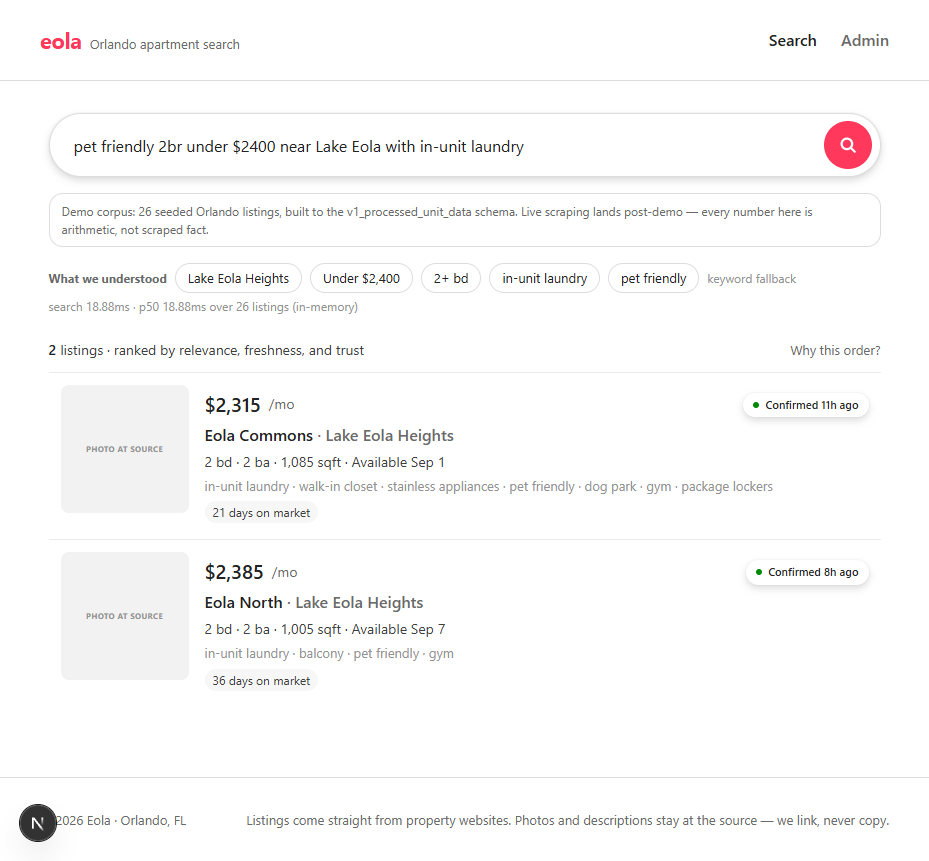

# apartmentscomv2

An Orlando apartment search engine: primary-source listings scraped politely
from communities' own public sites, structured at ingest, scored for trust and
freshness, and served behind a natural-language search bar.

Full runbook: [`apps/web/README.md`](apps/web/README.md).

## Automation

- **CI** (`.github/workflows/ci.yml`) — typecheck, every package's test suite
  in parallel against a PostGIS service container (each package gets its own
  `aptv2_test_<pkg>` database), the production web build, and a Playwright
  end-to-end job driving a real `next start` over a seeded corpus; on every
  push.
- **Scrape** (`.github/workflows/scrape.yml`) — scheduled polite scraping of
  the registered sources, three times daily.
- **AI Evals** (`.github/workflows/evals.yml`) — a golden query-parse
  regression against the live model, an extraction-sampling eval over both
  captured payload shapes judged by a stronger model, plus deterministic
  key-free suites that run in every CI pass: the same goldens through the
  keyword fallback rung, a filter-satisfaction sweep, and ranking/relaxation
  invariants; live suites on master merges and nightly.

This repository is private: it contains captured availability-payload fixtures
used as test data, and the project is a time-boxed demo.
